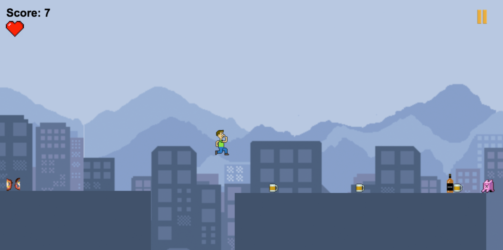

</a>
</a>

##How to play Beer Run Meteor

####In your terminal run the following commands
1. Clone Repository

2. Install Meteor:
<pre><code>curl https://install.meteor.com/ | sh</pre></code>

3. Launch Meteor from cloned directory:
<pre><code>meteor</pre></code>

4. Open up game by going to the following address on your browser:
<pre><code>http://localhost:3000</pre></code>

##How to Edit Game in Beer Run Yeoman

1. Go to Beer-Run Yeoman/Grunt/Browserify repository at:
[Beer Run OOP](https://github.com/althe1/beer-run2)

2. Clone Repository

3. Install Grunt:
<pre><code>npm install -g grunt-cli</pre></code> 

4. Install Yeoman:
<pre><code>npm install -g yo</pre></code>

5. Install Phaser Yeoman Generator:
<pre><code>npm install -g yo generator-phaser-official</pre></code>

6. Run server by typing:
<pre><code>grunt</pre></code>

7. Play game at:
<pre><code>http://localhost:9000</pre></code>

##Port game over from Yeoman to Meteor

1. Run grunt to compile main.js:
<pre><code>grunt</pre></code>

2. Copy main.js from Yeoman and to Beer Run Meteor:
<pre><code>cp game/prefabs/main.js Beer-Run/client/beer_run/</pre></code>

3. Rename main.js to beer_run.js and overwrite existing beer_run.js
<pre><code>mv -rf game/prefabs/main.js Beer-Run/client/beer_run/beer_run.js</pre></code>

4. Run updated game from by meteor by typing:
<pre><code>meteor</pre></code>

###Created By:

+ [Mariano Echegoyen](https://github.com/Mariano89)
+ [Alfred Kirakosian](https://github.com/althe1)
+ [Daniel Mendoza](https://github.com/dmendoza05)

####Project for General Assembly

####Built with:

 